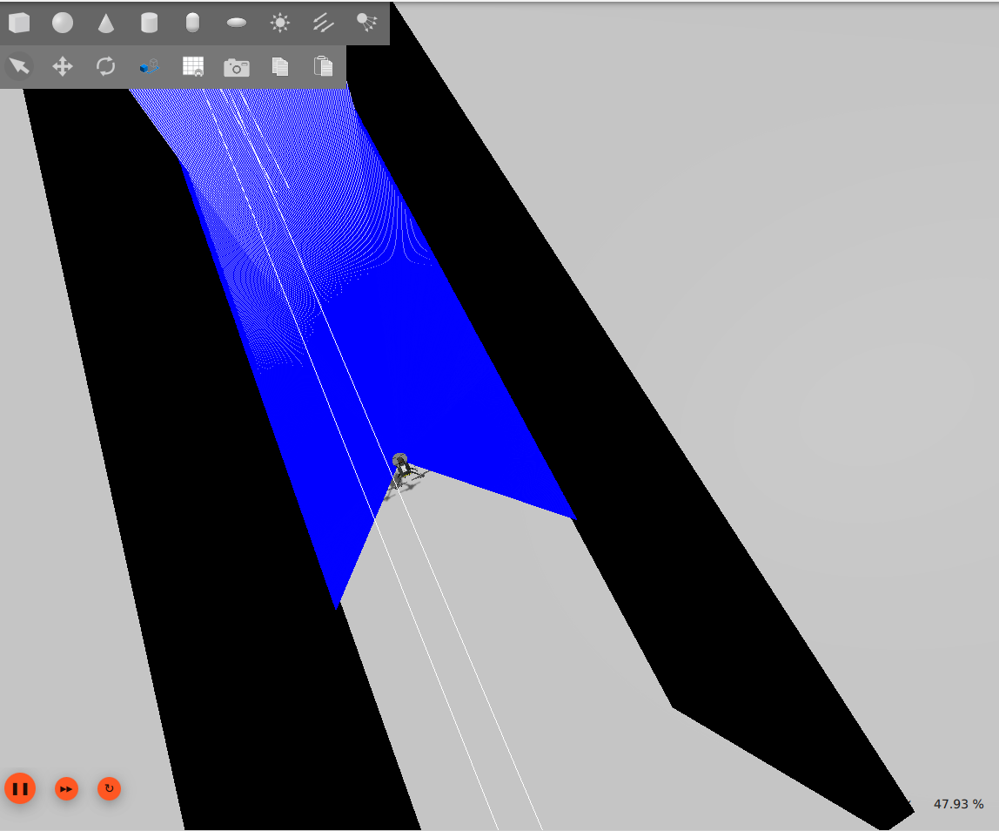
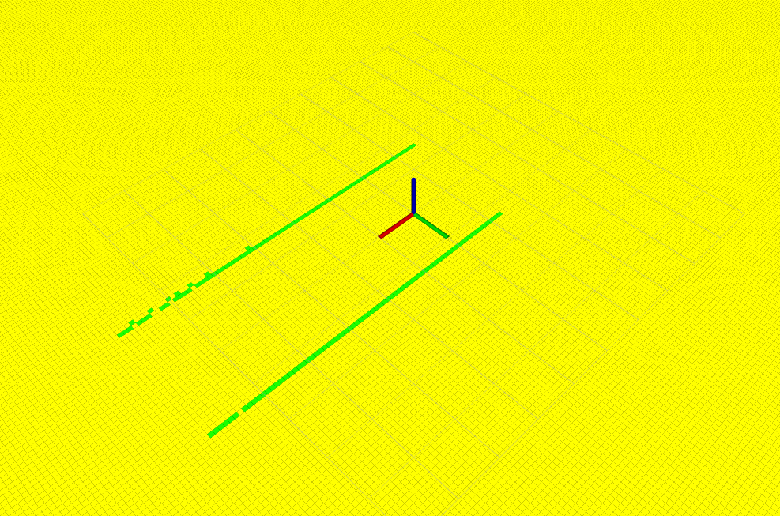
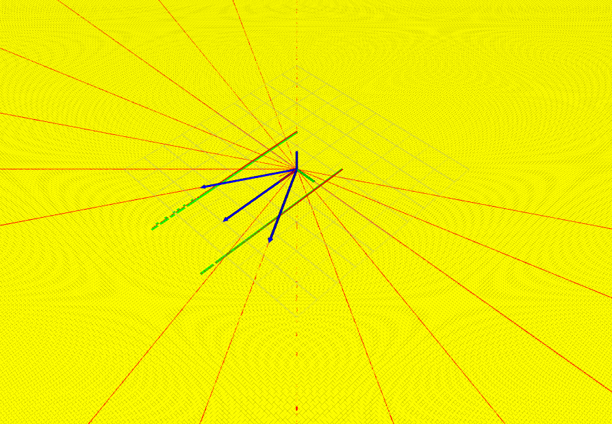

# PX4 Avoidance - Thuật toán VFH* tránh vật cản bằng LiDAR

Đây là gói **ROS2 C++** triển khai thuật toán **Vector Field Histogram Star (VFH*)** để tránh vật cản dựa trên dữ liệu **LiDAR** và **Odometry**.

Hệ thống sử dụng dữ liệu từ cảm biến LiDAR để xây dựng histogram vật cản và tìm ra hướng di chuyển an toàn cho robot hoặc UAV.

Project được thiết kế để tích hợp với:

* ROS2
* PX4 SITL
* Gazebo
* UAV hoặc robot có LiDAR

---

# Tổng quan thuật toán

Thuật toán **VFH*** hoạt động theo pipeline sau:

```
LiDAR Scan
    ↓
Xử lý dữ liệu LiDAR
    ↓
Histogram Grid
    ↓
Polar Histogram
    ↓
Binary Histogram
    ↓
Masked Histogram
    ↓
Candidate Directions
    ↓
Cost Function
    ↓
Optimal Heading
```

Nguyên lý hoạt động:

1. Thu thập dữ liệu từ LiDAR
2. Xây dựng bản đồ mật độ vật cản (**Histogram Grid**)
3. Chuyển sang histogram theo góc (**Polar Histogram**)
4. Xác định các hướng bị chặn và các hướng tự do
5. Tìm các hướng di chuyển khả thi
6. Sử dụng hàm chi phí để chọn hướng tối ưu

---

# Cấu trúc Project

```text
px4_avoidance
│
├── include/px4_avoidance
│   ├── binary_histogram.hpp
│   ├── candidate_search.hpp
│   ├── cost_function.hpp
│   ├── histogram_grid.hpp
│   ├── lidar_processing.hpp
│   ├── masked_histogram.hpp
│   ├── odom_tf.hpp
│   └── polar_histogram.hpp
│
├── src
│   ├── binary_histogram.cpp
│   ├── candidate_search.cpp
│   ├── cost_function.cpp
│   ├── histogram_grid.cpp
│   ├── lidar_processing.cpp
│   ├── masked_histogram.cpp
│   ├── odom_tf.cpp
│   ├── polar_histogram.cpp
│   └── vfh_star_node.cpp
│
├── CMakeLists.txt
└── package.xml
```

---

# Mô tả các module

## lidar_processing

Xử lý dữ liệu từ topic `/scan`.

Chuyển dữ liệu **sensor_msgs/LaserScan** thành các điểm vật cản trong hệ tọa độ robot.

---

## histogram_grid

Xây dựng **Histogram Grid** biểu diễn mật độ vật cản trong không gian 2D.

---

## polar_histogram

Chuyển **Histogram Grid** sang **Polar Histogram**.

Mỗi sector trong histogram biểu diễn mức độ nguy hiểm theo hướng đó.

---

## binary_histogram

Áp dụng ngưỡng để phân loại các sector:

* `0` → hướng an toàn
* `1` → hướng bị chặn

---

## masked_histogram

Loại bỏ các hướng không phù hợp với khả năng quay hoặc giới hạn động học của robot/UAV.

---

## candidate_search

Tìm các **candidate direction** từ các sector tự do trong masked histogram.

---

## cost_function

Đánh giá các hướng candidate bằng **hàm chi phí** dựa trên:

* hướng tới mục tiêu
* hướng di chuyển trước đó
* khoảng cách tới vật cản

Hướng có **chi phí nhỏ nhất** sẽ được chọn.

---

## odom_tf

Xử lý dữ liệu **Odometry** và transform giữa các frame tọa độ.

---

## vfh_star_node

Node ROS2 chính thực hiện toàn bộ pipeline của thuật toán **VFH***.

Node này:

1. Subscribe dữ liệu LiDAR
2. Xây dựng histogram vật cản
3. Tìm hướng an toàn
4. Publish hướng điều khiển

---

# Các topic sử dụng

| Topic          | Kiểu dữ liệu          | Mô tả            |
| -------------- | --------------------- | ---------------- |
| `/scan`        | sensor_msgs/LaserScan | dữ liệu LiDAR    |
| `/odom`        | nav_msgs/Odometry     | vị trí robot/UAV |
| `/lidar_point` | visualization_msgs/marker | dữ liệu lidar quét được dưới dạng điểm  |
| `/polar_histogram` | visualization_msgs/marker | phạm vi lidar dưới dạng biểu đồ cực và các sectors  |
| `/grid_obstacle` | nav_msgs/grid_cells | chuyển dữ liệu điểm thành dạng các điểm ô vuông  |
| `/polot_histogram` | std_msgs/float32_multi_array | bảng dữ liệu mật độ vật cản theo các hướng  |
| `/candidate_direction` | visualization_msgs/marker_array | hướng di chuyển  |

---

# Yêu cầu hệ thống

* Ubuntu
* ROS2 (Humble / Jazzy / Rolling)
* Gazebo
* PX4 SITL (tùy chọn)

---

# Build Project

Tạo ROS2 workspace:

```bash
mkdir -p ~/px4_ws/src
cd ~/px4_ws/src
```

Clone repository:

```bash
git clone <repo_url>
```

Build bằng **colcon**:

```bash
cd ~/px4_ws
colcon build
```

Source workspace:

```bash
source install/setup.bash
```

---

# Chạy node

Chạy node tránh vật cản:

```bash
ros2 run px4_avoidance vfh_star_node
```

---

# Mô phỏng

Project có thể chạy với:

* PX4 SITL
* Gazebo
* UAV có LiDAR

Pipeline mô phỏng:

```
PX4 SITL
   ↓
Gazebo LiDAR
   ↓
ROS2 topic /scan
   ↓
VFH* Node
   ↓
Heading Command
```

---

# Kết quả mô phỏng



Hình minh họa dữ liệu quét LiDAR trong mô phỏng Gazebo. Các tia quét màu xanh được sử dụng làm đầu vào cho thuật toán **VFH\*** để phát hiện vật cản và lựa chọn hướng di chuyển an toàn cho robot. Hai bên là hai bức tường chắn màu đen.

---



Hình trên biểu diễn **Histogram Grid** được xây dựng từ dữ liệu quét LiDAR. 
Không gian xung quanh robot được chia thành các ô lưới 2D, trong đó mỗi ô lưu trữ mật độ vật cản dựa trên khoảng cách và hướng của các điểm đo LiDAR. Ở đây các ô 2D màu xanh là mật độ cao, còn lại màu vàng là mật độ thấp.
Các ô có mật độ cao tương ứng với khu vực gần vật cản, trong khi các ô có mật độ thấp biểu diễn không gian tự do. 
Histogram Grid là bước trung gian quan trọng trước khi chuyển đổi sang **Polar Histogram** trong thuật toán VFH\* để xác định các hướng di chuyển an toàn.

---



Hình trên biểu diễn **Polar Histogram** được chuyển đổi từ Histogram Grid. 
Thay vì biểu diễn vật cản trong hệ tọa độ Descartes (x–y), dữ liệu được chuyển sang dạng histogram theo góc quanh robot. 
Mỗi sector trong biểu đồ tương ứng với một hướng quan sát và giá trị của nó thể hiện mật độ vật cản theo hướng đó. 
Các sector có giá trị lớn cho thấy sự hiện diện của vật cản, trong khi các sector có giá trị nhỏ biểu diễn các hướng có thể di chuyển an toàn. 
Polar Histogram là cơ sở để thuật toán **VFH\*** xác định các hướng tự do và lựa chọn hướng di chuyển tối ưu cho robot.

